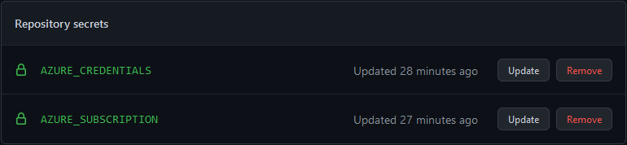

# GitHub actions deployment

## Setup necessary secrets

The deployment will use some secrets to be able to connect to azure for deploying the resources needed for this project.

First, you need to add a service principle in your azure ad so that github can authenticate and get access to the subscription level with access for creating resource groups and resources inside that group. To do that, follow this guide [Quickstart: Deploy Bicep files by using GitHub Actions](https://docs.microsoft.com/en-us/azure/azure-resource-manager/bicep/deploy-github-actions?tabs=userlevel%2CCLI).

One change from that guide that I did was that I granted access to the subscription level, not the resource group level as I wanted the resource group to also be created using bicep files. So the command I used for creating the service principle was:

````powershell
az ad sp create-for-rbac --role Contributor --scope /subscriptions/{YourSubscriptionID} --name {AppRegistrationName} --sdk-auth
````

> Change `YourSubscriptionID` with the subscription ID to the subscription you want to use in azure.
> The `--name AppRegistrationName` property will be the name as displayed inside the app registration in your azure tenant.

This will give you an Json that you can add as a secret to your repository under `Repository -> Settings -> Secrets -> New Repository Secret`.

You should also add the subscription ID as a secret, as this will be referenced in the source code. Then you should end up with this:



